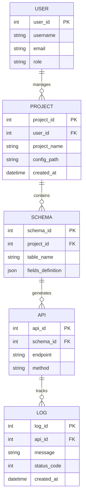

# ER Diagram: AutoCRUD.js Framework Metadata

## Entities and Attributes

### 1. User (System User/Developer)
* **user_id** (PK): Unique identifier for the developer.
* **username**: Name of the developer.
* **email**: Registered email.
* **role**: Role (Admin/Dev).

### 2. Project
* **project_id** (PK): Unique ID for each generated backend project.
* **user_id** (FK): Links to the user who created it.
* **project_name**: Name defined in YAML.
* **config_path**: Path to the YAML file.
* **created_at**: Timestamp.

### 3. Schema (Entity Definition)
* **schema_id** (PK): ID for each table/collection definition.
* **project_id** (FK): Links to the parent project.
* **table_name**: Name of the MongoDB collection.
* **definition_json**: Raw JSON storage of the YAML structure.

### 4. Api (Generated Endpoints)
* **api_id** (PK): Unique ID for each route.
* **schema_id** (FK): Links to the associated schema.
* **endpoint**: The URI path (e.g., `/api/users`).
* **method**: HTTP Verb (GET, POST, etc.).

### 5. Log (Activity/Error Tracking)
* **log_id** (PK): Unique log entry.
* **api_id** (FK): Links to the specific API that triggered the log.
* **message**: Error or success message.
* **status_code**: HTTP status code (200, 500, etc.).
* **created_at**: Timestamp.

---

## Relationships

* **User to Project**: One-to-Many (Ek user multiple projects manage kar sakta hai).
* **Project to Schema**: One-to-Many (Ek project mein multiple entities/tables ho sakti hain).
* **Schema to API**: One-to-Many (Ek schema/model ke multiple CRUD endpoints hote hain).
* **API to Log**: One-to-Many (Ek endpoint par multiple hits aur unke logs ho sakte hain).

---

## Mermaid ER Diagram

---

## Relationship Analysis (Plain English)

### 1. Developer (User) to Project (1:N)
A single developer can orchestrate multiple professional backend projects using the AutoCRUD.js engine. Each project is isolated and represents a unique configuration context.

### 2. Project to Schema/Entity (1:N)
Within a single project definition (YAML), the developer can define multiple entities (e.g., Products, Customers, Orders). The system treats each entity as an independent schema within the project's namespace.

### 3. Schema/Entity to API (1:N)
For every single entity defined in the YAML, the framework automatically "manufactures" five standard RESTful endpoints (GET all, POST create, GET search, PUT update, DELETE). This ensures that a single schema definition generates a comprehensive API surface.

### 4. API to Logs (1:N)
As client applications interact with the generated endpoints, the system tracks telemetry and error data. Each specific endpoint can generate thousands of individual log entries, which are used for health monitoring and auditing.

---

## Physical Mapping to MongoDB

At runtime, the framework translates these conceptual relationships into physical MongoDB collections:

- **Entity Collections**: Each entity defined in `config.yaml` becomes a dedicated collection (e.g., `products`, `customers`).
- **Metadata Management**: While the current version focus is on dynamic data, metadata like schemas and project settings are kept immutable in the framework memory, derived directly from the localized YAML source.
- **Log Collection**: System logs are streamed via the `Logger` utility and can be directed to a centralized `logs` collection for production monitoring.
- **Join Logic**: Relationships between collections (like a Product ID stored in an Order) are handled via standard Mongoose `ObjectId` references, enabling cross-entity data integrity.
