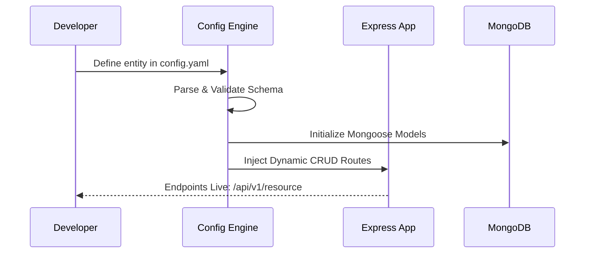
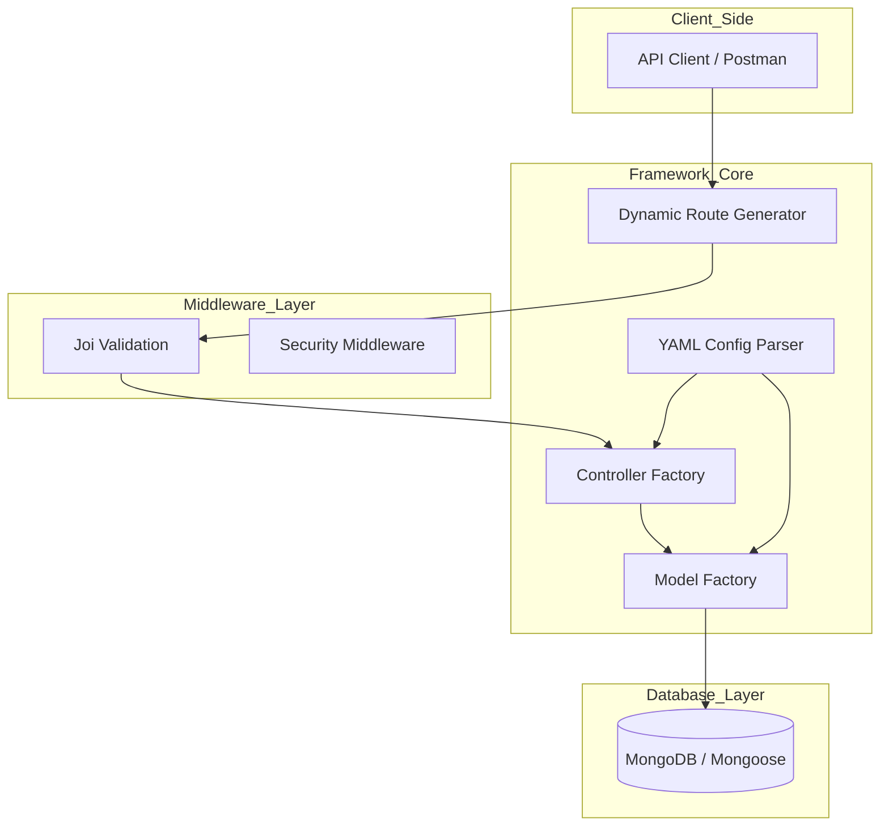

# AutoCRUD.js

AutoCRUD.js – A Configuration Driven and Automated Backend Framework for Rapid API Development

---

## Abstract :-

AutoCRUD.js is a custom-built backend framework developed using Node.js that enables developers to generate complete CRUD (Create, Read, Update, Delete) APIs automatically through a configuration file. Instead of manually writing repetitive backend code, developers define database structures in YAML format, and the framework generates models, controllers, routes, validation logic, and database connections dynamically. The project aims to improve productivity, reduce human errors, and promote clean software architecture using modern software engineering practices.

---

## Introduction :-

In today’s software industry, web and mobile applications require strong backend systems to manage users, data, authentication, and business logic. Backend development is often time-consuming because developers must repeatedly write similar code for different projects. This includes creating database models, API routes, controllers, validation logic, and error handling mechanisms.

AutoCRUD.js is designed to simplify this process by automating backend generation. The framework provides a configuration-driven approach where developers only focus on defining data structures while the framework handles the technical implementation. This helps both students and professionals in developing scalable backend systems efficiently.

---

## Motivation :-

The motivation behind developing AutoCRUD.js is based on the following observations:

1. Students spend more time writing boilerplate code than learning system design.
2. Developers repeat similar CRUD logic in every project.
3. Small startups require rapid development to reduce costs.
4. Manual coding increases maintenance complexity.
5. Learning professional backend architecture is difficult for beginners.

This project aims to address these issues by providing an educational and practical framework.

---

## Problem Statement :-

Backend developers face several major challenges:

### 1. Repetitive Development  
Every project requires similar CRUD operations, which are manually implemented.

### 2. Time Consumption  
Writing models, controllers, routes, and validation consumes significant time.

### 3. Error Prone Code  
Manual coding increases the probability of bugs and security flaws.

### 4. Poor Maintainability  
Schema changes require modifications in multiple files.

### 5. Lack of Standardization  
Different developers follow different coding styles, reducing consistency.

### 6. Learning Difficulty  
Beginners struggle to understand layered backend architecture.

These problems lead to slow development cycles and low productivity.

---

## Existing Systems and Their Limitations :-

Several platforms provide backend services, but they have limitations:

- Limited internal customization
- Dependency on third-party platforms
- Reduced learning opportunities
- Vendor lock-in
- Lack of architectural transparency

Such systems hide internal mechanisms, which prevents students from understanding system design principles.

---

## Proposed Solution :-

AutoCRUD.js provides a unified and configurable solution. The system reads a YAML configuration file that contains database schema definitions. Based on this configuration, the framework automatically:

- Creates database models
- Generates RESTful APIs
- Builds controllers
- Implements validation
- Connects to MongoDB
- Applies security middleware
- Handles errors centrally

This allows developers to build production-ready backends without repetitive coding.

---

## System Workflow :-

The working of AutoCRUD.js is divided into the following steps:

1. Developer creates config.yaml file.
2. ConfigParser loads configuration.
3. Database connection is initialized.
4. ModelFactory generates schemas.
5. ControllerFactory creates controllers.
6. Router dynamically registers routes.
7. Middleware is applied.
8. Server starts listening.
9. Client sends request.
10. Controller processes request.
11. Database stores or retrieves data.
12. Response is sent back.



This automated pipeline ensures consistency.

---

## System Architecture :-

AutoCRUD.js follows a modular layered architecture:



### 1. Presentation Layer  
Handles API requests and responses.

### 2. Configuration Layer  
Manages YAML-based configuration.

### 3. Business Layer  
Implements CRUD logic using controllers.

### 4. Factory Layer  
Generates models and controllers.

### 5. Persistence Layer  
Handles database operations.

### 6. Middleware Layer  
Manages security and parsing.

This separation improves scalability and maintainability.

---

## Demonstration (Sample Configuration) :-

To demonstrate the power of AutoCRUD.js, here is an example of a `config.yaml` file:

```yaml
project:
  name: "MyStoreAPI"
  version: "1.0.0"
  port: 5000

entities:
  - name: "Product"
    fields:
      title: { type: "string", required: true }
      price: { type: "number", min: 0 }
      category: { type: "string" }
      inStock: { type: "boolean", default: true }
    routes:
      - method: "GET"
        path: "/products"
      - method: "POST"
        path: "/products"
      - method: "DELETE"
        path: "/products/:id"

  - name: "Customer"
    fields:
      name: { type: "string", required: true }
      email: { type: "string", unique: true }
```

The framework parses this file and immediately makes the corresponding API endpoints live.

---

## Design Methodology :-

The framework is developed using object-oriented and modular design principles.

### Object-Oriented Principles  
- Encapsulation: Private properties inside classes  
- Abstraction: BaseController class  
- Inheritance: Child controllers  
- Polymorphism: Method overriding  

### Design Patterns  
- Factory Pattern: ModelFactory, ControllerFactory  
- Singleton Pattern: Database connection  
- Template Pattern: BaseController methods  

These ensure flexibility and reusability.

---

## Key Features :-

### Configuration Management  
Allows developers to define application structure in YAML format.

### Automatic CRUD Generation  
Eliminates manual API creation.

### MVC Architecture  
Separates business logic from routing.

### Dynamic Schema Generation  
Creates database schemas at runtime.

### Validation Framework  
Auto-generates Joi schemas.

### Centralized Error Handling  
Provides uniform error responses.

### Pagination and Sorting  
Optimizes large dataset handling.

### Security Layer  
Protects APIs using middleware.

### Logging System  
Tracks system activities.

### Extensibility  
Supports future plugins.

---

## Technology Stack :-

| Category | Technology |
|----------|------------|
| Runtime | Node.js |
| Framework | Express.js |
| Database | MongoDB |
| ORM | Mongoose |
| Validation | Joi |
| Config | YAML |
| Testing | Jest |
| DevOps | Docker (Future) |

---

## Implementation Strategy :-

The project is implemented in phases:

### Phase 1: Setup  
Project initialization and environment configuration.

### Phase 2: Configuration Parsing  
YAML parsing and validation.

### Phase 3: Model Generation  
Dynamic schema creation.

### Phase 4: Controller Development  
CRUD abstraction layer.

### Phase 5: Route Generation  
Automatic route mapping.

### Phase 6: Middleware Integration  
Security and parsing.

### Phase 7: Testing  
Unit and integration testing.

### Phase 8: Optimization  
Performance tuning.

---

## Use Cases :-

- Rapid API development
- Startup MVP creation
- Educational projects
- Admin dashboard backend
- Management systems
- Prototype testing

---

## Advantages :-

- Reduces coding effort
- Improves reliability
- Ensures consistency
- Enhances learning
- Saves development cost
- Improves scalability

---

## Limitations :-

- Not suitable for highly customized logic initially
- Limited frontend support
- Requires basic Node.js knowledge
- Performance tuning required for large-scale use

---

## Future Enhancements :-

1. JWT Authentication
2. CLI Tool
3. Plugin System
4. Microservices Support
5. GraphQL APIs
6. Cloud Deployment
7. Auto Scaling
8. AI-Based Monitoring
9. Caching Layer
10. API Gateway Support

---

## Evaluation Parameters :-

The project will be evaluated based on:

- Code quality
- Architecture design
- Performance
- Documentation
- Maintainability
- Scalability

---

## Conclusion :-

AutoCRUD.js provides an efficient and scalable solution for backend automation. By using configuration-driven development, the framework reduces repetitive coding and enforces standard architecture practices. This project serves as both a learning platform and a professional backend tool, making it suitable for academic and industrial applications.
