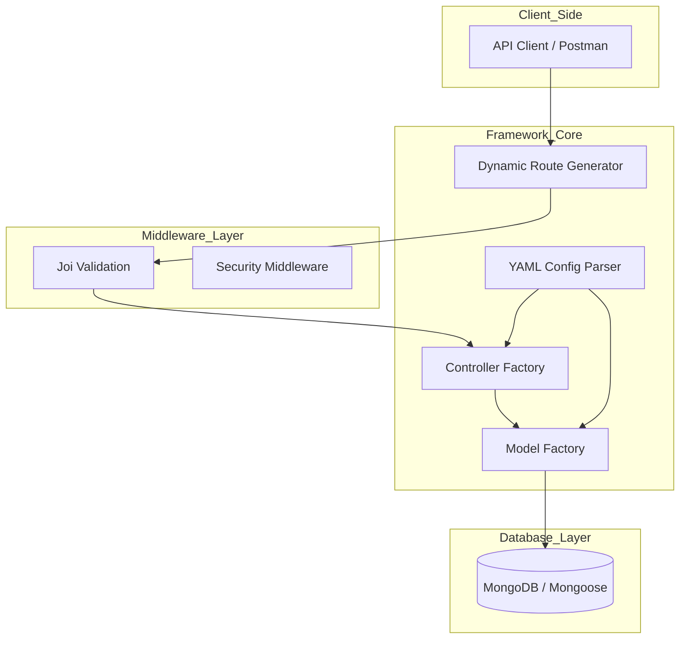
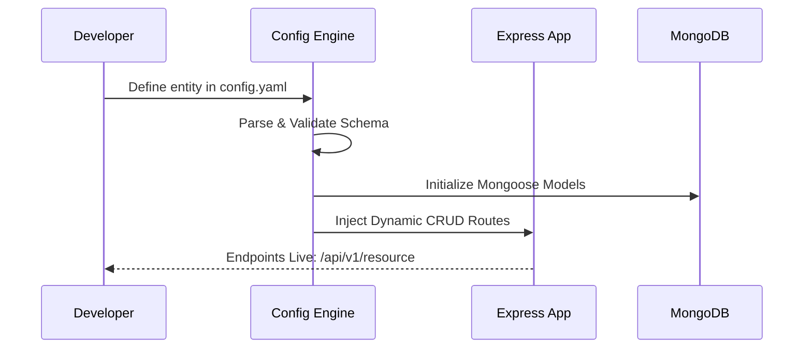

# AutoCRUD.js

AutoCRUD.js is a configuration-driven backend framework built with Node.js. It automates the creation of RESTful APIs by generating database models, controllers, and routes dynamically from a YAML configuration file.

## Project Goal :

The primary objective of AutoCRUD.js is to eliminate repetitive boilerplate code in backend development. By defining data structures in a centralized configuration file, developers can deploy production-ready CRUD operations without manual implementation of standard logic.

## System Architecture :-

## System Workflow :-

## Technology Stack :

| Component | Technology |
|-----------|------------|
| Runtime | Node.js |
| Framework | Express.js |
| Database | MongoDB & Mongoose |
| Validation | Joi |
| Config | YAML |

## Getting Started :-

1. Define your data models in the `config.yaml` file.
2. Initialize the framework to parse the configuration.
3. The server will dynamically register routes and models based on the definitions.

For detailed architecture, system design, and the project roadmap, please refer to idea.md.

## Developer

**Mohit Kourav ❤️**

