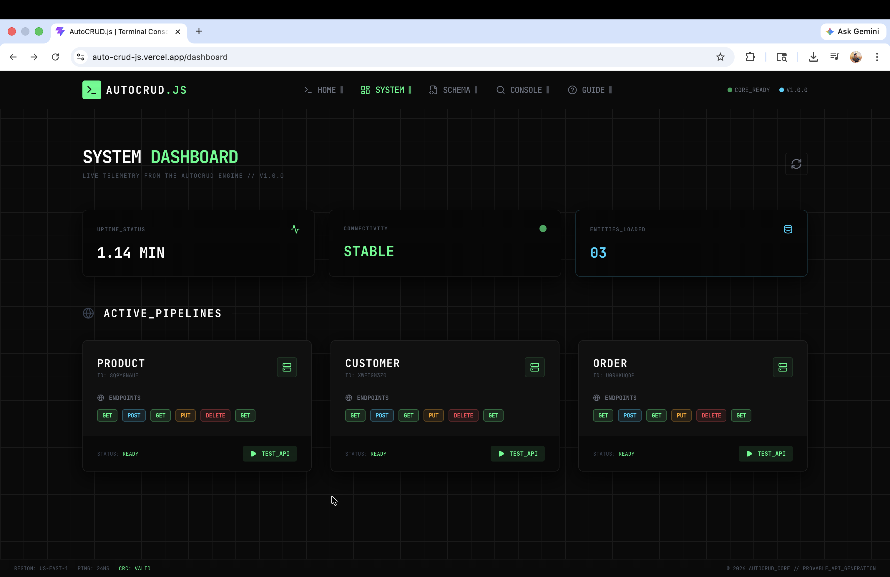
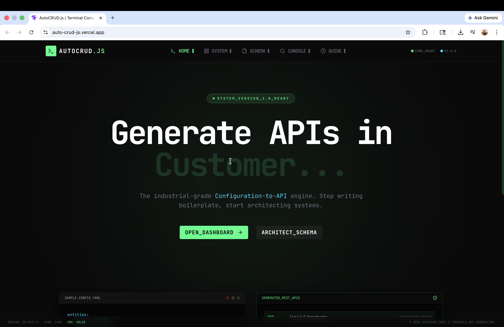
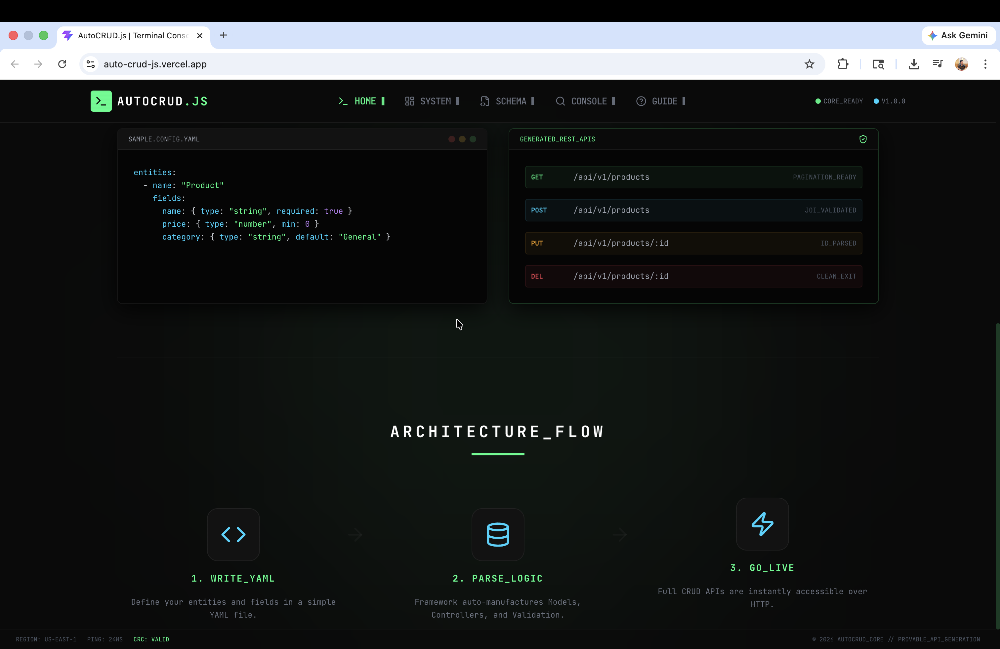
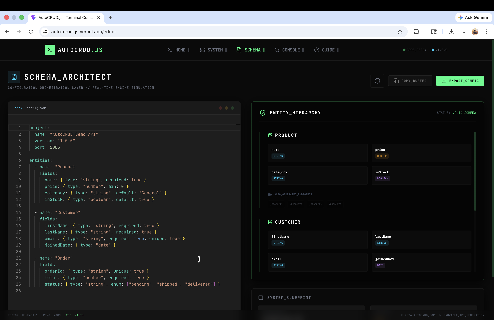
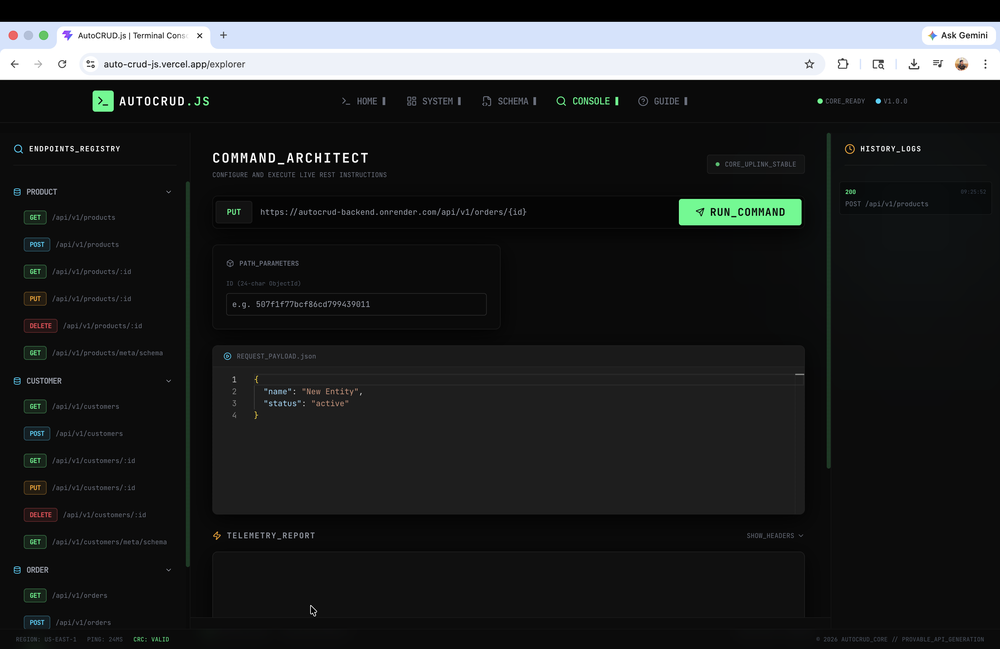
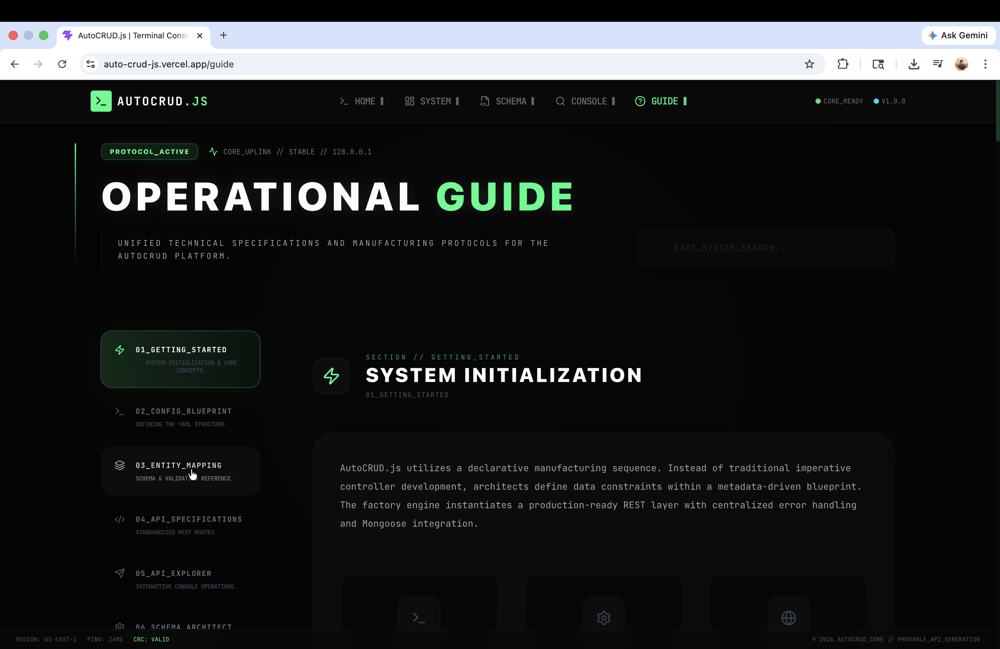
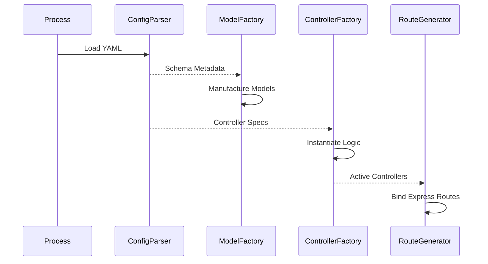
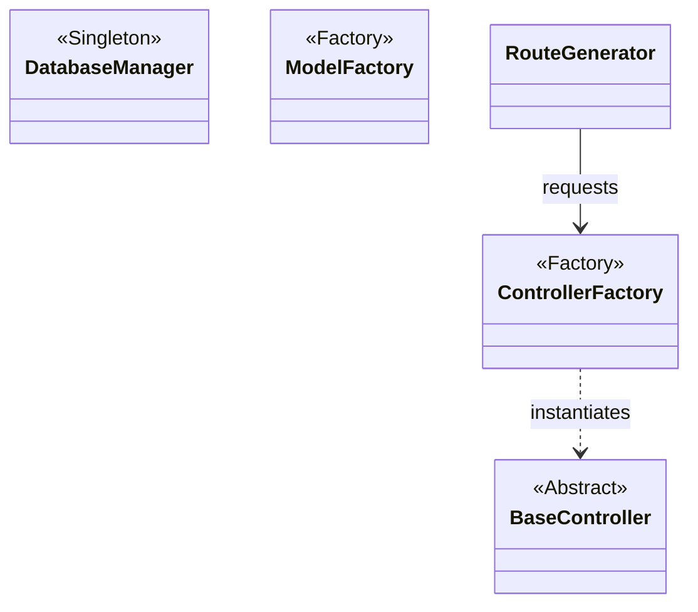

# AutoCRUD.js ⚡️


**The zero-boilerplate manufacturing plant for production-grade REST APIs.**

AutoCRUD.js is a metadata-driven backend framework built with Node.js that consumes simple YAML configurations to dynamically "manufacture" fully-functional, validated, and documented RESTful APIs in seconds.

---

### Demo & Aesthetics

*Real-time telemetry and active API pipelines dashboard.*

---

### Table of Contents
1. [Features](#features)
2. [Visual Tour](#visual-tour)
3. [Tech Stack](#tech-stack)
4. [Quick Start](#quick-start)
5. [Configuration Architect](#configuration-architect)
6. [API Reference](#api-reference)
7. [Architecture & Diagrams](#architecture--diagrams)
8. [Design Patterns](#design-patterns)
9. [Contributing](#contributing)
10. [License & Authors](#license--authors)

---

### Features
- **Dynamic Manufacturing**: Auto-generates Mongoose models, Express controllers, and REST routes.
- **Self-Healing Validation**: Joi-based validation schemas derived directly from YAML field types.
- **Terminal Dashboard**: High-fidelity React frontend with a developer-centric terminal aesthetic.
- **Live API Explorer**: Built-in interactive REST client for testing generated endpoints.
- **OOP Core**: Built with strict adherence to SOLID principles and professional design patterns.
- **Real-time Telemetry**: Integrated latency monitoring and status code tracking.

---

### Visual Tour

#### 1. Command Center (Hero)

*The high-fidelity terminal landing page where the manufacturing process begins.*

#### 2. Architecture & Flow

*Visualizing the 3-step lifecycle: Define YAML, Parse Logic, and Go Live.*

#### 3. Schema Architect

*A built-in Monaco editor for defining entities with real-time hierarchy visualization.*

#### 4. System Telemetry

*Real-time monitoring of active pipelines, uptime, and connectivity status.*

#### 5. Command Architect (API Explorer)

*An interactive REST client to test your generated endpoints directly from the dashboard.*

#### 6. Operational Guide

*In-app documentation and technical specifications for the entire platform.*

---

### Tech Stack
| Category | Technology |
|---|---|
| **Runtime** | Node.js (ES Modules) |
| **Backend** | Express.js, Mongoose, Joi, YAML |
| **Frontend** | React 19, Vite, TailwindCSS, Monaco Editor |
| **Telemetry** | Custom Middleware + performance-now |
| **Testing** | Jest |
| **Deployment** | Vercel (UI), Render (API), Docker |

---

### Quick Start

#### 1. Clone & Install
```bash
git clone https://github.com/yourusername/AutoCRUD.js.git
cd AutoCRUD.js/backend
npm install
```

#### 2. Environment Setup
```bash
cp .env.example .env
# Open .env and add your MONGODB_URI and PORT
```

#### 3. Launch the Factory
```bash
# Start Backend
npm run dev

# Start Frontend (in separate terminal)
cd ../frontend
npm install
npm run dev
```

---

### Configuration Architect
The entire API surface is defined in a single `config.yaml` file.

**Sample Configuration:**
```yaml
project:
  name: "AutoCRUD Demo API"
  port: 5000

entities:
  - name: "Product"
    fields:
      title: { type: "string", required: true }
      price: { type: "number", min: 0 }
      category: { type: "string", default: "General" }
      inStock: { type: "boolean", default: true }
```

**Field Breakdown:**
- `project`: Global metadata for the application.
- `entities`: Array of resource definitions.
- `name`: The entity name (automatically pluralized for routes, e.g., `Product` -> `/api/v1/products`).
- `fields`: Key-value pairs defining the data schema and Joi validation rules.

---

### API Reference
AutoCRUD.js generates 5 standard endpoints + 2 discovery endpoints for every entity.

| Method | Endpoint | Description |
|---|---|---|
| `GET` | `/api/v1/:resource` | Get all records (with pagination/sorting) |
| `POST` | `/api/v1/:resource` | Create a new record (validated) |
| `GET` | `/api/v1/:resource/:id` | Get record by ID |
| `PUT` | `/api/v1/:resource/:id` | Update record by ID |
| `DELETE` | `/api/v1/:resource/:id` | Delete record by ID |
| `GET` | `/api/v1/routes` | View all registered discovery routes |
| `GET` | `/api/v1/health` | System health and entity overview |

**Example Search (GET):**
```bash
curl "http://localhost:5000/api/v1/products?limit=5&sort=price&order=desc"
```

---

### Architecture & Diagrams

#### 1. Factory Sequence (System Boot)

```mermaid
sequenceDiagram
    participant OS as Process
    participant CP as ConfigParser
    participant MF as ModelFactory
    participant CF as ControllerFactory
    participant RG as RouteGenerator
    
    OS->>CP: Load YAML
    CP-->>MF: Schema Metadata
    MF->>MF: Manufacture Models
    CP-->>CF: Controller Specs
    CF->>CF: Instantiate Logic
    CF-->>RG: Active Controllers
    RG->>RG: Bind Express Routes
```

#### 2. Class Architecture

```mermaid
classDiagram
    class DatabaseManager
    <<Singleton>> DatabaseManager
    class ModelFactory
    <<Factory>> ModelFactory
    class ControllerFactory
    <<Factory>> ControllerFactory
    class BaseController
    <<Abstract>> BaseController

    RouteGenerator --> ControllerFactory : requests
    ControllerFactory ..> BaseController : instantiates
```

---

### Design Patterns
#### 1. Singleton Pattern (`DatabaseManager.js`)
Used to ensure only one database connection pool exists, preventing redundant overhead.
```javascript
static getInstance() {
    if (!DatabaseManager.#instance) {
        DatabaseManager.#instance = new DatabaseManager();
    }
    return DatabaseManager.#instance;
}
```

#### 2. Factory Pattern (`ModelFactory.js`)
Orchestrates the dynamic manufacturing of Mongoose models from YAML metadata at runtime.
```javascript
static createModel(name, entityConfig) {
    const schema = this.createSchema(entityConfig);
    const model = mongoose.model(name, schema);
    this.#modelsRegistry.set(name, model);
    return model;
}
```

#### 3. Template Method (`BaseController.js`)
Standardizes the CRUD execution algorithm (Try/Catch, Pagination logic, Response formatting) while allowing the underlying model to vary per entity.

---

### Contributing
Contributions are what make the open source community such an amazing place to learn, inspire, and create.
1. Fork the Project
2. Create your Feature Branch (`git checkout -b feature/AmazingFeature`)
3. Commit your Changes (`git commit -m 'Add some AmazingFeature'`)
4. Push to the Branch (`git push origin feature/AmazingFeature`)
5. Open a Pull Request

---

- **Author**: Mohit Kourav

---
**Build Backends Faster. Define, Don't Code.**
