# Class Diagram: AutoCRUD.js Framework Architecture

This diagram illustrates the structural organization of the AutoCRUD.js backend, showing the relationships between factories, controllers, and core utility classes.

## Mermaid Class Diagram

```mermaid
classDiagram
    class ConfigParser {
        -String filePath
        -Object config
        +loadYAML() Object
        +validateSchema() void
        +getParsedData() Object
    }

    class DatabaseManager {
        <<Singleton>>
        -static DatabaseManager instance
        -MongooseConnection connection
        +static getInstance() DatabaseManager
        +connect(uri) void
        +disconnect() void
        +isConnected() Boolean
    }

    class ModelFactory {
        <<Factory>>
        -static Map modelsRegistry
        +static createSchema(entityConfig) MongooseSchema
        +static createModel(name, config) MongooseModel
        +static generateAll(entities) void
        +static getModel(name) MongooseModel
    }

    class BaseController {
        <<Abstract>>
        #MongooseModel model
        +create(req, res, next) void
        +getAll(req, res, next) void
        +getById(req, res, next) void
        +update(req, res, next) void
        +delete(req, res, next) void
        #_buildQuery(queryParams) Object
    }

    class ControllerFactory {
        <<Factory>>
        +static createController(model, entity) BaseController
        +static createAll(modelsMap, entities) Map
    }

    class RouteGenerator {
        -ExpressApp app
        -Array routes
        +generateRoutes(entities, controllers, models) void
        +getRegisteredRoutes() Array
        -registerDiscoveryRoutes(resource, name) void
    }

    class ValidationMiddleware {
        +static generateJoiSchema(fields) JoiSchema
        +static validate(fields) Middleware
        +static validateId() Middleware
    }

    class ResponseFormatter {
        +static success(res, data, status, message) void
        +static error(res, message, status, errors) void
        +static paginated(res, data, pagination) void
    }

    class Logger {
        +static info(msg) void
        +static error(msg) void
        +static warn(msg) void
        +static requestLogger() Middleware
    }

    %% Relationships
    ConfigParser ..> ModelFactory : feeds configuration
    ConfigParser ..> ControllerFactory : feeds configuration
    DatabaseManager --* RouteGenerator : dependency
    ModelFactory --* BaseController : provides model
    ControllerFactory --|> BaseController : instantiates
    RouteGenerator --> ControllerFactory : requests controllers
    RouteGenerator --> ValidationMiddleware : applies to routes
    BaseController --> ResponseFormatter : formats output
    BaseController ..> Logger : logs activity
    ValidationMiddleware ..> ResponseFormatter : formats errors
```

## Structural Overview

### 1. The Manufacturing Layer
The **ModelFactory** and **ControllerFactory** are the heart of the framework. They transform static YAML definitions into live, functional Mongoose models and Express logic.

### 2. The Abstraction Layer
The **BaseController** provides a robust, standardized implementation of CRUD operations. It uses inheritance to ensure that every auto-generated entity behaves consistently, while providing protected helpers like `_buildQuery` for complex filtering.

### 3. The Orchestration Layer
**RouteGenerator** acts as the final assembler, binding the manufactured controllers and models to the Express application while injecting **ValidationMiddleware** as a security gatekeeper.

### 4. The Utility Layer
Classes like **ResponseFormatter**, **Logger**, and the **DatabaseManager** (Singleton) provide common services that are utilized across all other layers to ensure code reusability and a single source of truth for system states.
