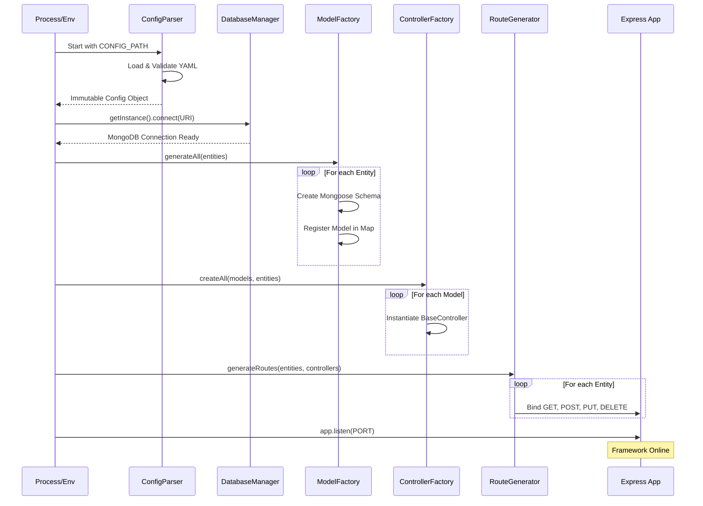
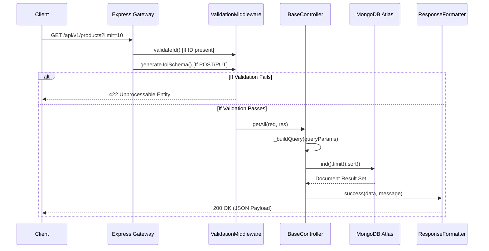

# Sequence Diagram: AutoCRUD.js Framework Lifecycle

This document provides a technical breakdown of the temporal interactions within the framework, divided into the **Boot Phase** and the **Runtime Phase**.

## 1. System Initialization (Factory Boot)
This sequence shows how the framework "manufactures" the API surface upon application startup.

## 2. API Request Lifecycle (The Production Line)
This sequence shows how a single REST request is processed after the framework is live.

## Description of Interactions

### 1. Boot Logic
The framework utilizes the **Factory Pattern** extensively during boot. The `ConfigParser` acts as the single source of truth, feeding schema definitions into the `ModelFactory`, which then allows the `ControllerFactory` to prepare the business logic layer.

### 2. Runtime Pipeline
Every request passes through an automated validation gate (`ValidationMiddleware`) before reaching the `BaseController`. This ensures that the database never encounters malformed data, maintaining the integrity of the dynamically generated models.
