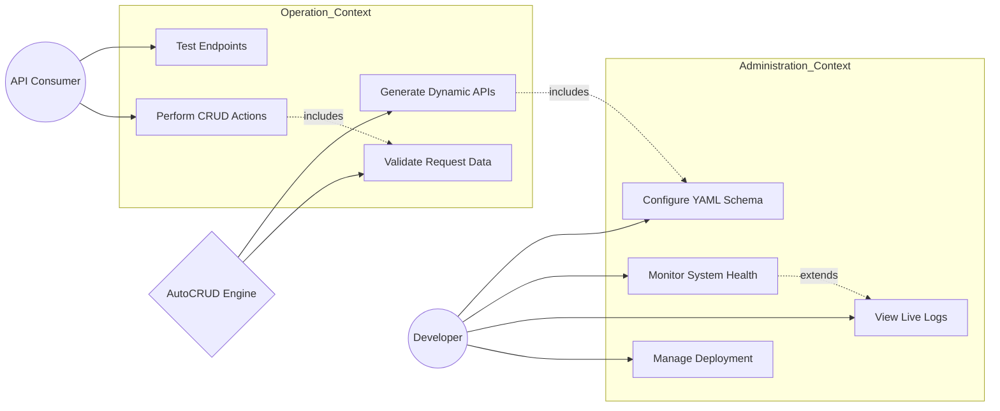

# Use Case Diagram: AutoCRUD.js Framework

The following diagram illustrates the functional requirements of the AutoCRUD.js framework from the perspective of different stakeholders.

## Actors
- **Developer**: Architect of the system who defines schemas and monitors the framework.
- **API Consumer**: Client applications or developers using the generated REST surface.
- **System**: The AutoCRUD core engine that orchestrates the automation pipeline.

## Mermaid Use Case Diagram

## Description of Use Cases

### 1. Configure YAML Schema
The Developer provides a structural definition of entities. This is the primary trigger for the entire framework lifecycle.

### 2. Generate Dynamic APIs
The System consumes the YAML and "manufactures" Mongoose models, Express controllers, and RESTful routes without manual coding.

### 3. Monitor System Health
The Developer checks the `/health` and `/routes` discovery endpoints to ensure the factory is operating within normal parameters.

### 4. Test Endpoints
The API Consumer uses the interactive **Explorer** to simulate requests and verify the generated logic against real-world data.

### 5. Validate Request Data
The System automatically applies Joi validation rules derived from the YAML field definitions before allowing any data to reach the database.
